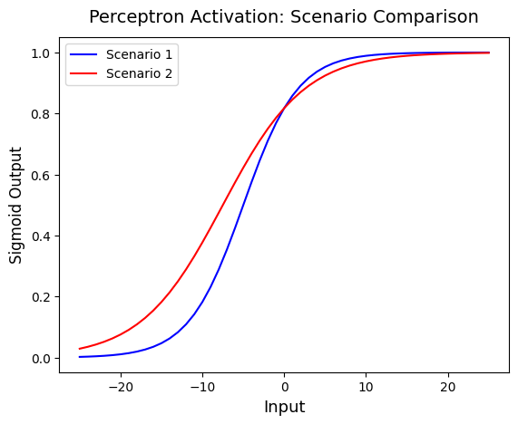

# Single-Layer Perceptron: Scenario Comparison

Practical analysis of a sigmoid activation function in a single-layer perceptron, comparing two input scenarios.

This project explores the fundamentals of single-layer perceptrons by implementing and visualizing different input scenarios.
Experiment with different parameters to observe how they affect the activation curves.

## Built With
- Python
- Pandas
- Matplotlib

## Scenarios
- Scenario 1: All 3 inputs active
- Scenario 2: 2 out of 3 inputs active
